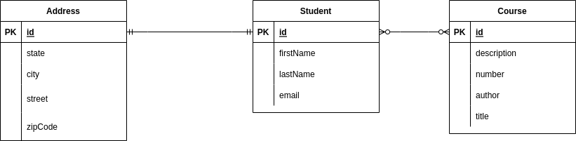

# Spring Data JPA projections

```info
Author      Ter-Petrosyan Hakob
Created     2022-04-15 
Updated     2022-12-08
```

- [Overview](#overview)
- [Project setup](#project-setup)
- [Create entities](#create-entities)
  - [Student entity](#student-entity)
  - [Course entity](#course-entity)
  - [Address entity](#address-entity)
- [Create repository](#create-repositories)
  - [Student repository](#student-repository)
  - [Course repository ](#course-repository)
  - [Address repository ](#address-repository)
- [Interface Based Projections](#interface-based-projections)  
  - [Close Projection](#close-projection)
  - [Open Projection](#open-projection)
- [Class Based Projections](#class-based-projections)
- [Dynamic Projections](#dynamic-projections)
- [Tuple projection](#tuple-projection)
- [Map @Query result to dto](#map-query-result-to-dto)
- [Conclusion](#conclusion)

---


## Overview

Spring JPA gives us the ability via repository easy work with our data but the repository returned all entity representations, 
sometimes we don't need all representations, in this case, we can use projections. 


## Project setup

For demo purposes let's create a simple project:

```groovy
plugins {
    id 'org.springframework.boot' version '2.6.7'
    id 'io.spring.dependency-management' version '1.0.11.RELEASE'
    id 'java'
}

group = 'com.htp'
version = '0.0.1'
sourceCompatibility = '17'

repositories {
    mavenCentral()
}

dependencies {
    implementation 'org.springframework.boot:spring-boot-starter-data-jpa'
    runtimeOnly 'com.h2database:h2'
    testImplementation 'org.springframework.boot:spring-boot-starter-test'
}

tasks.named('test') {
    useJUnitPlatform()
}
```

## Create entities

To make things simple let's create three simple entities




### Student entity

```java
@Entity
public class Student {

    @Id
    @GeneratedValue(strategy = GenerationType.SEQUENCE)
    private Long id;

    private String firstName;
    private String lastName;
    private String email;

    @ManyToMany(mappedBy = "students", fetch = FetchType.EAGER)
    public List<Course> courses = new ArrayList<>();

    @OneToOne(mappedBy = "student")
    private Address address;   
    
    // getters and setters
}    

```

### Course entity

```java
@Entity
public class Course {

    @Id
    @GeneratedValue(strategy = GenerationType.SEQUENCE)
    private Long id;

    private String title;
    private String description;
    private Integer number;
    private String author;

    @ManyToMany(cascade = {
            CascadeType.PERSIST,
            CascadeType.MERGE
    })
    @JoinTable(
            name = "student_course",
            joinColumns = @JoinColumn(name = "course_id", referencedColumnName = "id"),
            inverseJoinColumns = @JoinColumn(name = "student_id", referencedColumnName = "id")
    )
    private List<Student> students = new ArrayList<>();

    // getters and setters

}  
```

### Address entity

```java

@Entity
public class Address {

    @Id
    @GeneratedValue(strategy = GenerationType.SEQUENCE)
    private Long id;

    @OneToOne
    private Student student;

    private String state;

    private String city;

    private String street;

    private String zipCode;

    //getters and setters
}
```    

## Create repositories

Let's create repositories for our entities.

*Student repository*

```java
public interface StudentRepository extends JpaRepository<Student, Long> {
}

```

*Course repository*

```java
public interface CourseRepository extends JpaRepository<Course, Long> {
}
```

*Address repository*

```java
public interface AddressRepository extends JpaRepository<Address, Long> {
}
```

## Interface Based Projections

In this type, we create an interface with only getter methods of properties we want from an entity class. 
This interface will be the return type of query method we write in repository.

### Close Projection

In Close Projection, the getter methods of interface match exactly with the getter methods of Entity’s properties. 

Let’s declare a projection interface for the Course and Student entities as shown below.

`Course view`

```java

public interface CourseView {

    String getTitle();

    Integer getNumber();

    String getAuthor();
}
```

```java
public interface CurseAuthorStudentView {

    String getTitle();

    Integer getNumber();

    List<CourseStudentView> getStudents();

    interface CourseStudentView {

        String getFirstName();

        String getEmail();
    }
}
```

Let's add two methods to our course repository

```java
public interface CourseRepository extends JpaRepository<Course, Long> {

    Optional<CourseView> getByNumber(Integer number);

    List<CurseAuthorStudentView> getByAuthor(String author);
}

```
---

`Student View`

```java
public interface StudentView {

    String getEmail();

    String getFirstName();

    StudentAddressView getAddress();

    List<StudentCourseView> getCourses();

    interface StudentCourseView {
        String getTitle();

        Integer getNumber();

    }

    interface StudentAddressView {

        String getZipCode();
    }
}
```

```java

public interface StudentRepository extends JpaRepository<Student, Long> {

    Optional<StudentView> getByEmail(String email);
}
```


Ok let's summarize in the course repository  we have the getByNumber method which should return CourseView  and 
the getByAuthor which should return CurseAuthorStudentView.

In the student repository we have getByEmail mehtod which should return StudentView.

Let's write some tests for our repository

`test application.properties`

```properties
jdbc.driverClassName=org.h2.Driver
jdbc.url=jdbc:h2:mem:myDb;DB_CLOSE_DELAY=-1

hibernate.dialect=org.hibernate.dialect.H2Dialect
hibernate.hbm2ddl.auto=create

spring.jpa.properties.hibernate.show_sql=true
spring.jpa.properties.hibernate.use_sql_comments=true
spring.jpa.properties.hibernate.format_sql=true

hibernate.cache.use_second_level_cache=false
hibernate.cache.use_query_cache=false
```

`insert_data.sql`
```sql
INSERT INTO student (id, email, first_name, last_name)
VALUES(1, 'gurgen@mail.com', 'Gurgen', 'Aloyan');

INSERT INTO address (id, student_id, state, city, street, zip_code)
VALUES(1, 1, 'AR', 'Armavir', 'Test', '00001');

INSERT INTO course (id, author, description, number, title)
VALUES(1, 'James Gosling', 'course description', 1, 'Java');

INSERT INTO student_course (course_id, student_id)
VALUES(1,1);
```

`clean_up_data.sql`
```sql
DELETE FROM address;
DELETE FROM student_course;
DELETE FROM course;
DELETE FROM student;
```


`test for CourseRepository`

```java

@DataJpaTest
@Sql(scripts = "/insert_data.sql")
@Sql(scripts = "/clean_up_data.sql", executionPhase = AFTER_TEST_METHOD)
class CourseRepositoryTest {

    @Autowired
    private CourseRepository courseRepository;

    @Test
    void getByNumberTest() {
        var courseViewOptional = courseRepository.getByNumber(1);

        assertFalse(courseViewOptional.isEmpty());
        var courseView = courseViewOptional.get();

        assertEquals(courseView.getNumber(), 1);
        assertEquals(courseView.getTitle(), "Java");
        assertEquals(courseView.getAuthor(), "James Gosling");
    }

    @Test
    void getByAuthorTest() {
        var list = courseRepository.getByAuthor("James Gosling");

        assertFalse(list.isEmpty());
        assertEquals(list.size(), 1);

        var course = list.get(0);
        assertEquals(course.getNumber(), 1);
        assertEquals(course.getTitle(), "Java");

        var students = course.getStudents();
        assertFalse(students.isEmpty());
        assertEquals(students.size(), 1);

        var student = students.get(0);
        assertEquals(student.getEmail(), "gurgen@mail.com");
        assertEquals(student.getFirstName(), "Gurgen");
    }
}
```

> **NOTE**
> Spring creates a proxy instance of the projection interface for each entity object, and all calls to the proxy are forwarded to that object.

`test for StudentRepository`

```java
@DataJpaTest
@Sql(scripts = "/insert_data.sql")
@Sql(scripts = "/clean_up_data.sql", executionPhase = AFTER_TEST_METHOD)
public class StudentRepositoryTest {

    @Autowired
    private StudentRepository studentRepository;

    @Test
    void getByEmailTest() {
        var studentViewOptional = studentRepository.getByEmail("gurgen@mail.com");

        assertFalse(studentViewOptional.isEmpty());

        var studentView = studentViewOptional.get();
        assertEquals(studentView.getEmail(), "gurgen@mail.com");
        assertEquals(studentView.getFirstName(), "Gurgen");

        assertNotNull(studentView.getAddress());
        assertEquals(studentView.getAddress().getZipCode(), "00001");

        var courses = studentView.getCourses();
        assertFalse(courses.isEmpty());
        assertEquals(courses.size(), 1);

        var course = courses.get(0);
        assertEquals(course.getTitle(), "Java");
        assertEquals(course.getNumber(), 1);
    }
}
```

### Open Projection

Open projection enable us to define interface methods with unmatched names and with return values computed at runtime.

Let's create a new view for student

```java
public interface StudentInfoView {

    @Value("#{target.firstName + ' ' + target.lastName}")
    String getFullName();

    String getEmail();


    AddressView getAddress();

    interface AddressView {
        @Value("#{target.state + '/' + target.city}")
        String getFullAddress();
    }
}
```

and add a new method to student repository

```java
public interface StudentRepository extends JpaRepository<Student, Long> {

    //...

    StudentInfoView getByFirstName(String firstName);
}
```

`test for getByFirstName method`

```java

@DataJpaTest
@Sql(scripts = "/insert_data.sql")
@Sql(scripts = "/clean_up_data.sql", executionPhase = AFTER_TEST_METHOD)
public class StudentRepositoryTest {

    @Autowired
    private StudentRepository studentRepository;

    //... 

    @Test
    void getByFirstNameTest() {
        var studentInfoView = studentRepository.getByFirstName("Gurgen");
        assertEquals(studentInfoView.getEmail(), "gurgen@mail.com");
        assertEquals(studentInfoView.getFullName(), "Gurgen Aloyan");
        assertEquals(studentInfoView.getAddress().getFullAddress(), "AR/Armavir");
    }
}
```

> **NOTE**
> Open projections have a drawback. Spring Data cannot optimize query execution as it doesn’t know in advance which properties will be used. 
> Thus, we should only use open projections when closed projections aren’t capable of handling our requirements.

## Class Based Projections

Instead of using proxies Spring Data creates from projection interfaces, we can define our own projection classes.

- Parameter names of the class constructor must match the properties of the root entity class
-  Also, define equals and hashCode implementations; they allow for processing projection objects in a collection

let's create AddressDto


```java
public class AddressDto {
    private String city;
    private String street;

    public AddressDto(String city, String street) {
        this.city = city;
        this.street = street;
    }

    //getters, setters, equals and hashCode
}    

```

and add a new method to address repository

```java
public interface AddressRepository extends JpaRepository<Address, Long> {

    List<AddressDto> findByZipCode(String zipCode);
}
```

`test for findByZipCode method`

```java
@DataJpaTest
@Sql(scripts = "/insert_data.sql")
@Sql(scripts = "/clean_up_data.sql", executionPhase = AFTER_TEST_METHOD)
public class AddressRepositoryTest {

    @Autowired
    private AddressRepository addressRepository;

    @Test
    void findByZipCodeTest() {
        var listOfAddress = addressRepository.findByZipCode("00001");

        assertFalse(listOfAddress.isEmpty());
        assertEquals(1, listOfAddress.size());
        var address = listOfAddress.get(0);

        assertEquals("Armavir", address.getCity());
        assertEquals("Armavir", address.getStreet());
    }
}
```

## Dynamic Projections

For dynamic projections, we should declare method in the repository  with a Class

let's create StudentDto

```java
public class StudentDto {
    private Long id;
    private String firstName;
    private String email;

     public StudentDto(Long id, String firstName, String email) {
        this.id = id;
        this.firstName = firstName;
        this.email = email;
    }

    //getters, setters, equals and hashCode
}     
```

and add a new method to studet repository

```java
public interface StudentRepository extends JpaRepository<Student, Long> {
 
    <T> T findByFirstName(String firstName, Class<T> clazz);

    //...
}
```

`test for findByFirstName method`

```java

@DataJpaTest
@Sql(scripts = "/insert_data.sql")
@Sql(scripts = "/clean_up_data.sql", executionPhase = AFTER_TEST_METHOD)
public class StudentRepositoryTest {

    //...

    @Test
    void findByFirstName() {
        var studentInfoView = studentRepository.findByFirstName("Gurgen", StudentInfoView.class);
        assertEquals(studentInfoView.getEmail(), "gurgen@mail.com");
        assertEquals(studentInfoView.getFullName(), "Gurgen Aloyan");
        assertEquals(studentInfoView.getAddress().getFullAddress(), "AR/Armavir");

        var studentView  = studentRepository.findByFirstName("Gurgen", StudentView.class);
        assertEquals(studentView.getEmail(), "gurgen@mail.com");
        assertEquals(studentView.getFirstName(), "Gurgen");

        assertNotNull(studentView.getAddress());
        assertEquals(studentView.getAddress().getZipCode(), "00001");

        var courses = studentView.getCourses();
        assertFalse(courses.isEmpty());
        assertEquals(courses.size(), 1);

        var course = courses.get(0);
        assertEquals(course.getTitle(), "Java");
        assertEquals(course.getNumber(), 1);

        var studentDto  = studentRepository.findByFirstName("Gurgen", StudentDto.class);
        assertEquals(1, studentDto.getId());
        assertEquals(studentView.getFirstName(), "Gurgen");
        assertEquals(studentView.getEmail(), "gurgen@mail.com");

    }
}   
```

## Tuple projection

Let's create findStudentsEmailAndIdAndCityByZipCode method in AddressRepository and
map the SQL projection recording a JPA Tuple container.

```java
public interface AddressRepository extends JpaRepository<Address, Long> {

    //...

    @Query("SELECT a.student.id as studentId, a.student.email as email, a.city as city  " +
            "FROM Address a WHERE a.zipCode = :zipCode")
    List<javax.persistence.Tuple> findStudentsEmailAndIdAndCityByZipCode(@Param("zipCode") String zipCode);
}

```

And as usual writing unit test.

```java

@DataJpaTest
@Sql(scripts = "/insert_data.sql")
@Sql(scripts = "/clean_up_data.sql", executionPhase = AFTER_TEST_METHOD)
public class AddressRepositoryTest {

    //...

    @Test
    void findStudentsEmailAndIdAndCityByZipCode() {
        var tuples = addressRepository.findStudentsEmailAndIdAndCityByZipCode("00001");
        assertEquals(1, tuples.size());

        var tuple = tuples.get(0);
        assertEquals(1, tuple.get("studentId", Long.class));
        assertEquals("Armavir", tuple.get("city", String.class));
        assertEquals("gurgen@mail.com", tuple.get("email", String.class));
    }
}
```
Together tuple we can use a Map<String, Object>. 


## Map @Query result to dto

As you can see in previous we do type casting and is not good and not safe  for type safety, we can use class Dto.
Let's create StudentInfoDTO

```java

public class StudentInfoDTO {
    private Long studentId;
    private String email;
    private String city;

    public StudentInfoDTO(Long studentId, String email, String city) {
        this.studentId = studentId;
        this.email = email;
        this.city = city;
    }

    //getters and setters

}    
```

now let's add findStudentsInfoByZipCode method in StudentRepository

```java
public interface AddressRepository extends JpaRepository<Address, Long> {

    //...

    @Query("SELECT new com.hakobtp.blog.dto.StudentInfoDto(student.id, a.student.email,  a.city)" +
            "FROM Address a WHERE a.zipCode = :zipCode")
    List<StudentInfoDto> findStudentsInfoByZipCode(@Param("zipCode") String zipCode);
}
```

And as usual writing unit test.

```java

@DataJpaTest
@Sql(scripts = "/insert_data.sql")
@Sql(scripts = "/clean_up_data.sql", executionPhase = AFTER_TEST_METHOD)
public class AddressRepositoryTest {

    //...

    @Test
    void findStudentsInfoByZipCode() {
        var students = addressRepository.findStudentsInfoByZipCode("00001");
        assertEquals(1, students.size());

        var student = students.get(0);
        assertEquals(1, student.getStudentId());
        assertEquals("Armavir", student.getCity());
        assertEquals("gurgen@mail.com", student.getEmail());
    }
}
```


## Conclusion

The source code for this article is available [over on GitHub](https://github.com/blog-source/spring-data-jpa-projections){:target="_blank" rel="noopener"}.

---

[Home](./../../README.md) 
| [<< Spring Data JPA](./tutorials.md)