## Introducing Window Functions

```info
Author : Ter-Petrosyan Hakob
Last updated: 2022-01-24
```

- [Introducing the Dataset](#introducing-the-dataset)
- [Where do Aggregate functions lag?](#where-do-aggregate-functions-lag)
- [What are Window Functions in SQL?](#what-are-window-functions-in-sql)
- [Understanding SQL Window Functions Over Clause](#understanding-sql-window-functions-over-clause)
- [Windowing with PARTITION BY](#windowing-with-partition-by)
- [Arranging Rows within Partitions](#arranging-rows-within-partitions)
- [Window Functions](#window-functions)
    - [Row_Number](#row_number)
    - [Rank vs Dense_Rank](#rank-vs-dense_rank)
    - [Nth_Value](#nth_value)
    - [Ntile](#ntile)
    - [Lead and Lag](#lead-and-lag)

---

### Introducing the Dataset

Before going further, let me introduce you to the dummy dataset we will be working on in this article. Assume there is 
a company that maintains the employee’s name, job, and salary records as follows:

<p align="center">
  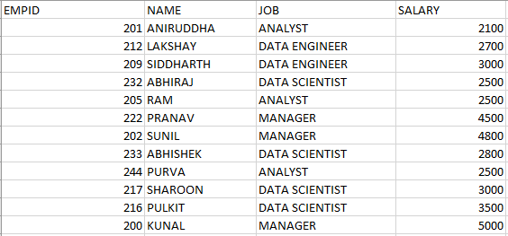
</p>


We are going to use this sample dataset to understand the concepts in this article. Alright, let’s get started!

### Where do Aggregate functions lag?

Suppose you want to determine the total salary of all the employees in the company. How would you go about it? You can 
simply use the SUM() aggregate function on the SALARY column.


<p align="center">
    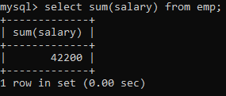
</p>

How about determining the total salary of employees per job category? Use the last query and append a GROUP BY clause on 
the JOB column.

<p align="center">
    
</p>


Now let me pose two more questions for you:


1)  Display the total salary and the total salary per job category along with every row value.

2)  Arrange the salary in a decreasing order within each job category..


Did you get it?  No? Probably?

These definitely weren`t as easy as the first ones that you were able to get instantly. But why?

Well, if you think about it, the former queries required simple aggregate functions to solve the problem. SQL aggregate 
functions only give us a single value for the group of rows aggregated together (think of the first query we wrote).

But the latter queries couldn`t simply be solved using such functions. Those queries want us to maintain the original 
identity of the individual rows, something that the aggregate functions fail to address. Therefore, to solve such queries 
we need different kinds of functions – the Window functions.

### What are Window Functions in SQL?

Window functions perform calculations on a set of rows that are related together. But, unlike the aggregate functions, 
windowing functions do not collapse the result of the rows into a single value. Instead, all the rows maintain their 
original identity and the calculated result is returned for every row.

### Understanding SQL Window Functions Over Clause

For example, if I were to display the total salary of employees along with every row value, it would look something 
like this:

<p align="center">
    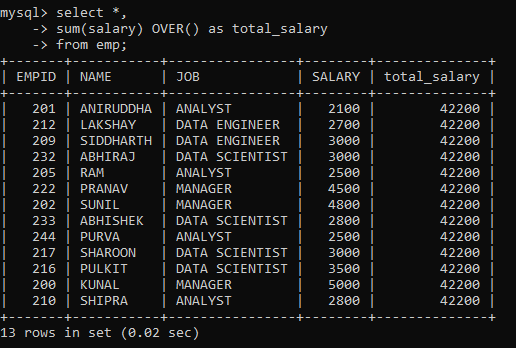
</p>

The OVER clause signifies a window of rows over which a window function is applied. It can be used with aggregate 
functions, like we have used with the SUM function here, thereby turning it into a window function. Or, it can also be 
used with non-aggregate functions that are only used as window functions (we will learn more about them in the later 
sections).

So the syntax for defining a simple window function that outputs the same value for all rows is as follows:

```sql
window_function_name(<expression>) OVER ( )
```

But, how about applying the window function to specific rows instead of on the entire table?

### Windowing with PARTITION BY

The PARTITION BY clause is used in conjunction with the OVER clause. It breaks up the rows into different partitions.
These partitions are then acted upon by the window function.

For example, to display the total salary per job category for all the rows we would have to modify our original SQL 
query as follows:

<p align="center">
    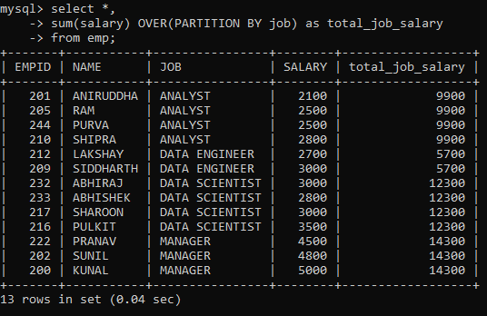
</p>

As you can see, the total_job_salary column depicts the sum of sales for that specific job category and not for the entire table.

So, the syntax for defining window function for the partition of rows is as follows:

```sql
window_function_name(<expression>) OVER (<partition_by_clause>)
```

Now, how about arranging the rows within each partition?


### Arranging Rows within Partitions

We know that to arrange rows in a table, we can use the ORDER BY clause. So, to arrange rows within each partition, we 
have to modify the OVER clause with the ORDER BY clause.

<p align="center">
    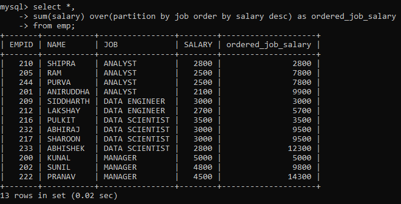
</p>

Here, the rows have been partitioned as per their job category as indicated by the JOB column. As you scroll down, you 
will notice the SALARY column has been ordered in descending order and the ordered_job_salary column depicts the running 
total of the job category (starting over after every partition).

So, the syntax for defining window function for the partition of rows and arranging them in order is as follows:

```sql
window_function_name(<expression>) OVER (<partition_by_clause> <order_clause>)
```

### Window Functions

Now that we know how to define window functions using the OVER clause and some of its modified versions, we can finally 
move on to working with the window functions!

#### Row_Number

Sometimes your dataset might not have a column depicting the sequential order of the rows, as is the case with our 
dataset. In that case, we can make use of the ROW_NUMBER() window function. It assigns a unique sequential number to 
each row of the table.

<p align="center">
    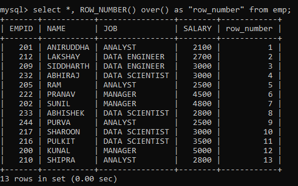
</p>


Notice that the numbering starts from 1. Also, to prevent any clash with the MySQL keyword for the function, I have put 
the column name within quotes.

But, since it is a window function, we can also limit it to partitions and then order those partitions.

<p align="center">
    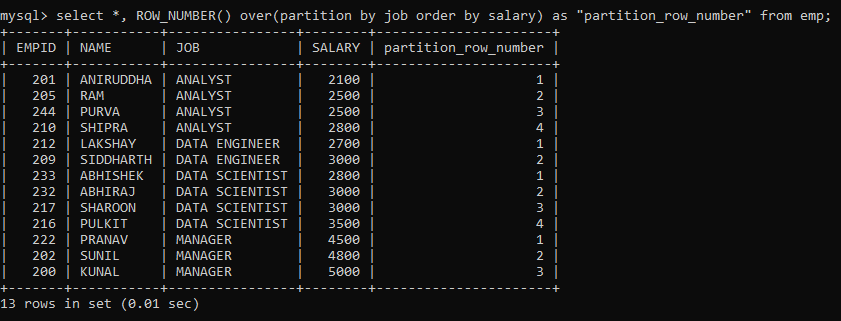
</p>

Here, we have partitioned the rows on the JOB column and ordered them based on the SALARY of the employee. Notice how 
the numbering restarts each time a new partition begins.

But suppose we want to rank the employees based on their salaries?

### Rank vs Dense_Rank

The RANK() window function, as the name suggests, ranks the rows within their partition based on the given condition.

<p align="center">
    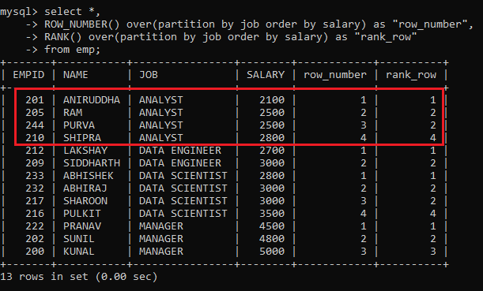
</p>

Notice the highlighted portion. In the case of ROW_NUMBER(), we have a sequential number. On the other hand, in the 
case of RANK(), we have the same rank for rows with the same value.

But there is a problem here. Although rows with the same value are assigned the same rank, the subsequent rank skips 
the missing rank. This wouldn’t give us the desired results if we had to return “top N distinct” values from a table. 
Therefore we have a different function to resolve this issue.

The DENSE_RANK() function is similar to the RANK() except for one difference, it doesn’t skip any ranks when ranking rows.

<p align="center">
    
</p>

Here, all the ranks are distinct and sequentially increasing within each partition. As compared to the RANK() function, 
it has not skipped any rank within a partition.

### Nth_Value

If you want to retrieve the nth value from a window frame for an expression, then you can use 
the NTH_VALUE(expression, N) window function.

For example, to retrieve the third-highest salary in each JOB category, we can partition the rows according to the JOB 
column, then order the rows within the partitions according to decreasing salary, and finally, use the NTH_VALUE 
function to retrieve the value. The command will be as follows:

<p align="center">
    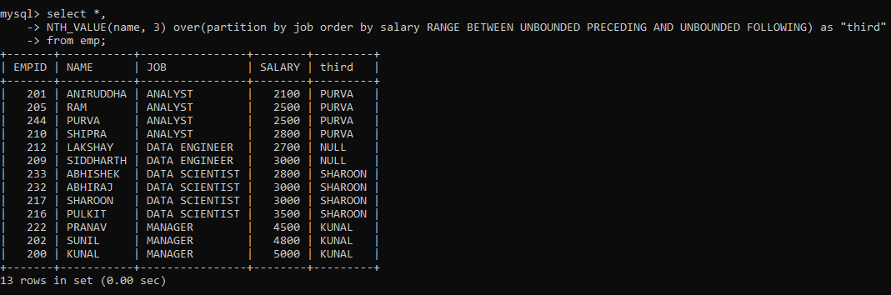
</p>

You must have noticed something different after the Order By clause. That is the Frame clause. It determines the subset 
of the partition (or frame) that will be used by the window function to calculate the value for the current row.

Here, I mentioned that all preceding and following rows for a current row be considered as within the frame when 
applying the window function. But why did I use the frame clause here and not with other functions? This is because 
the other window functions work on the entire partition even if a frame clause is provided. But only NTH_VALUE() can 
work on frames within a partition

Now suppose you wanted to output the first value from each partition? Although there is a  FIRST_VALUE() function 
as well, I am going to use the NTH_VALUE for the same.

<p align="center">
    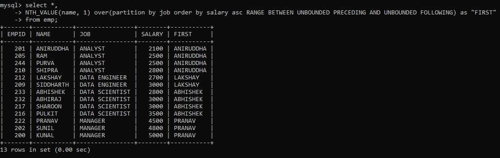
</p>

Similarly, just we also have a LAST_VALUE() function. But I am going to determine the last value within each partition 
just as above, albeit using the decreasing order of rows.

<p align="center">
    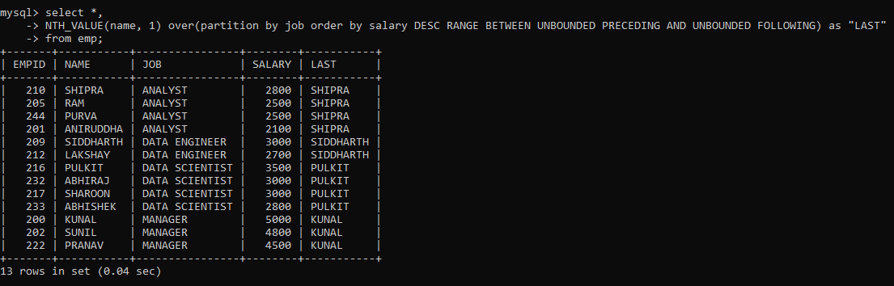
</p>

### Ntile

Sometimes, you might want to sort the rows within the partition into a certain number of groups. This is useful when you 
want to determine the percentile, quartile, etc. a particular row falls into. The NTILE() function is used for such 
purposes. It returns the group number for each of the rows in the partition.

For example, let’s find the quartile for each row based on the SALARY of the employee:

<p align="center">
    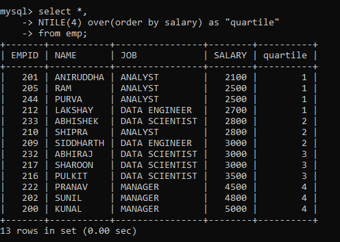
</p>

Similarly, you can divide the rows into different numbers of groups and calculate the NTILE for different partitions.

### Lead and Lag

Often, you might want to compare the value of the current row to that of the preceding or succeeding row. It helps in 
the easy analysis of the data. The LEAD() and LAG() window functions are there just for this purpose.

<p align="center">
    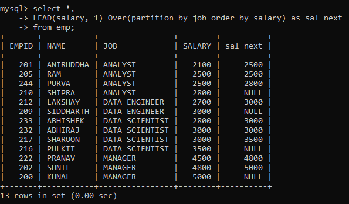
</p>

Here, we created a new column containing SALARY from the next row within each partition ordered by salary using the 
LEAD function. Notice that the last row from each partition contains a null value because there is no succeeding row 
for it to pull data from.

Now, let’s do the same with the LAG function.

<p align="center">
    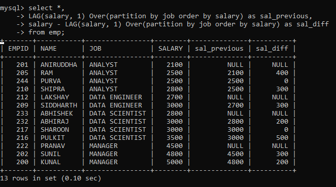
</p>

Here, we created two new columns. The first column contains SALARY from the previous row within each partition ordered 
by salary. While the second column contains the difference between SALARY from the previous row and the current row. 
As you can see, this is very helpful for a quick analysis of the difference between salaries within the same partition.


[home](./../../README.md) 
| [<< Spring Tutorial List](./../page.md)

